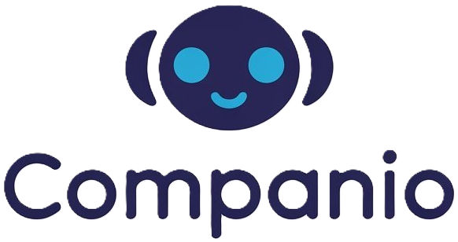

# Companio: Real-time AI Teaching Platform

Welcome to **Companio**, an advanced Learning Management System (LMS) SaaS application designed for interactive, real-time AI-powered teaching sessions. Built with Next.js, Clerk, Supabase, and OpenAI, Companio empowers users to learn any subject through engaging voice conversations with AI tutors.



## 🚀 Features

- **AI Tutors:** Real-time, interactive voice learning with AI-powered companions.
- **Personalized Sessions:** Choose subjects, topics, voice, and style for a custom experience.
- **User Profiles:** Track progress, completed lessons, and bookmark favorite companions.
- **Modern UI:** Responsive and beautiful interface with [Geist font](https://vercel.com/font) and Tailwind CSS.
- **Authentication:** Seamless sign-in/sign-up with Clerk.
- **Analytics & Error Monitoring:** Integrated with Sentry for robust monitoring.
- **Deployment Ready:** Easily deploy on Vercel.

## 🛠️ Tech Stack

- **Frontend:** [Next.js](https://nextjs.org), TypeScript, Tailwind CSS
- **Authentication:** [Clerk](https://clerk.dev/)
- **Database & Backend:** [Supabase](https://supabase.io/)
- **AI/ML:** OpenAI (GPT-4), Deepgram (voice to text), ElevenLabs (text to voice)
- **Monitoring:** Sentry
- **Deployment:** Vercel

## 📦 Getting Started

Clone the repository and install dependencies:

```bash
git clone https://github.com/Krish-H/LMS-SASS-app.git
cd LMS-SASS-app
npm install
```

Create a `.env.local` file and add your credentials for Supabase and Clerk. (See `.env.example` if available.)

Start the development server:

```bash
npm run dev
# or
yarn dev
```

Open [http://localhost:3000](http://localhost:3000) to see the app.

## 🧑‍💻 Usage

- Sign in to create your AI companions.
- Choose a subject (Math, Science, Coding, etc.), topic, voice, and style.
- Start a voice session and interact with your AI tutor in real time.
- Track your progress and completed lessons in your profile.

## 📚 Learn More

- [Next.js Documentation](https://nextjs.org/docs)
- [Clerk Documentation](https://clerk.dev/docs)
- [Supabase Documentation](https://supabase.com/docs)
- [OpenAI Documentation](https://platform.openai.com/docs)

## ☁️ Deploy on Vercel

Deploy instantly with [Vercel](https://vercel.com/new?utm_medium=default-template&filter=next.js&utm_source=create-next-app&utm_campaign=create-next-app-readme).

For deployment instructions, see the [Next.js deployment documentation](https://nextjs.org/docs/app/building-your-application/deploying).

## 🛡️ License

This project is licensed under the MIT License.

---

> Made with ❤️ by [Krish-H](https://github.com/Krish-H)
